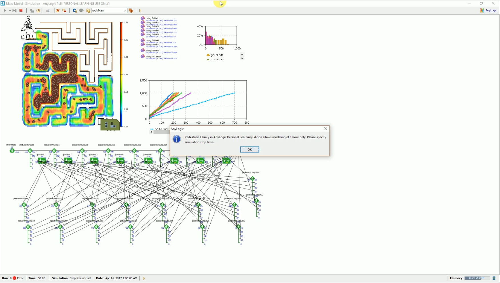
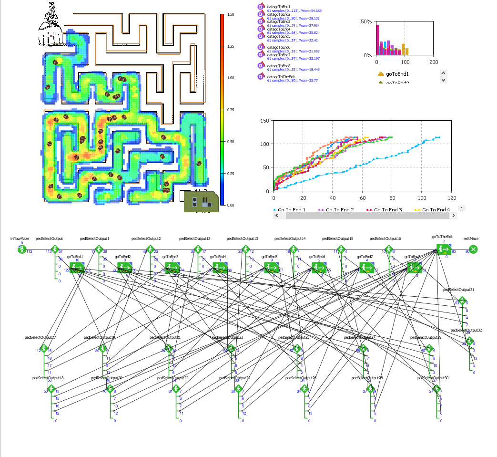
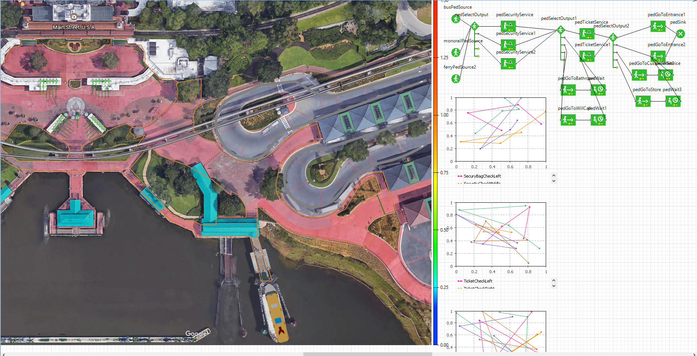
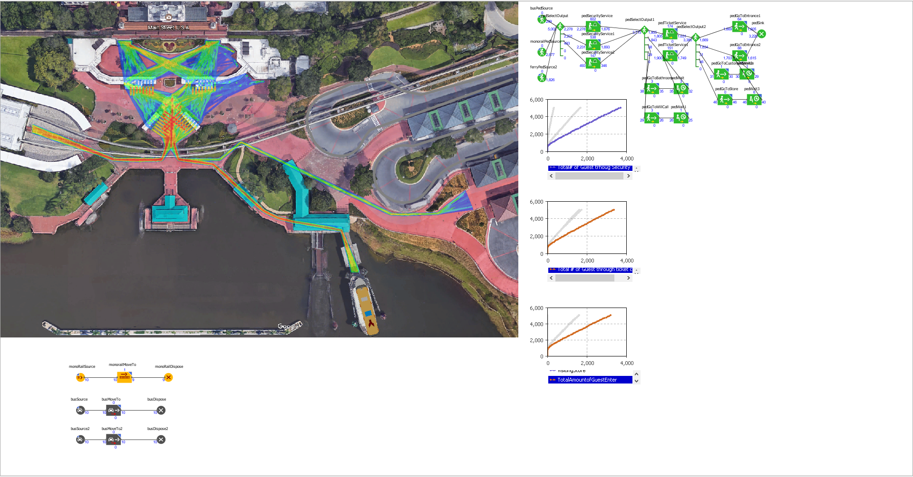

# Homework 3 : Agent based Simulation Assignment 

## IDS6938-Simulation Techniques - [University of Central Florida](http://www.ist.ucf.edu/grad/)

[University of Central Florida](http://www.ist.ucf.edu/grad/)
Student: Roberto Cabrera

This is the framework for homework #3. 

The assignment is due: **Monday, April  24 at 11:59PM (EST)**

Dr. Kyder has added 24 Hrs. Now the assignment is due on  ** Tuesday, April, 25 at 11:59PM (EST)**

# Introduction
The goal of this assignment is to enable the behavioral animation of vehicle-like walking agents. 

You will be expected to compose a *final report* which demonstrates your understanding on the material in each section of the assignment. Be visual! - Pictures say a thousand words so you do not have to. Show off your different configurations and really explore the assignment.

### Part 1: Behaviors

The goal of this assignment is to enable the steering behavioral animation of agents.

We represent an agent as a two-dimensional disk with mass (**m**) and moment-of-inertia (**I**) that is capable of generating a force **F** along body x-axis with a torque about the z-axis. For this assignment assume that the agent only translates in the world x-y plane and rotates about the body z-axis.

**(a) - 10 points** : Compute derivative vector given input and state vectors. Implement the function *SIMAgent::FindDeriv()*. This function sets derive vector to appropriate values after being called.

Description of agent state vector and input vector:  
* state[0] is the position of the agent in local body coordinates (almost useless in this project);  
* state[1] is the orientation angle of the agent with respect to world (i.e. global) coordinates;  
* state[2] is the velocity of the agent  in local body coordinates.  
* state[3] is the angular velocity of the agent in world coordinates. 
* input[0] is the force in local body coordinates;  
* input[1] is the torque in local body coordinates

You will need to set deriv[0], deriv[1], deriv[2], deriv[3]. Compute derivative vector given input and state vectors. This function sets derive vector to appropriate values after being called. 
* deriv[0] is the velocity of the agent in local body coordinates
* deriv[1] is the angular velocity of the agent in world coordinates
* deriv[2] is the force in local body coordinates divided by the mass.
* deriv[3] is the torque in local body coordinates divided by the inertia.
 
  The computation of the derivative vectors given input and state vectors are define within the method SIMAgent::FindDeriv().  The SIMAgent::FindDeriv() method is found in Agent.cpp on the following path: \IDS6938-SimulationTechniques\Homework3\BehaviorSimFramework\src.

You also must implement *SIMAgent::InitValues()*: Try to figure out appropriate values for control and behavior settings. You need to find out appropriate values for: *SIMAgent::Kv0, SIMAgent::Kp1, SIMAgent::Kv1, SIMAgent::KArrival, SIMAgent::KDeparture,
SIMAgent::KNoise,	SIMAgent::KWander, SIMAgent::KAvoid, SIMAgent::TAvoid, SIMAgent::RNeighborhood, SIMAgent::KSeparate, SIMAgent::KAlign, SIMAgent::KCohesion.*

  The control behavior setting are implemented on the method SIMAgent::InitValues() of the Agent.cpp file.  When the program is first run, the values are display on the right Graphic Unit Interface (GUI) panel.
  

Figure 1: Control and Behavior setting values.

**(b) - 20 points**: In this part of the assignment you will need to implement 6 types of individual behaviors and 5 types of group behaviors. Create the following behaviors through appropriate computation of V d  and θd  commands:
* Seek
* Flee
* Arrival
* Departure
* Wander
* Obstacle Avoidance

I have implemented 6 types of individual agent behaviors in the Agent.cpp file.  They can be found in the clarification of vec2 SIMAgent::Seek(), vec2 SIMAgent::Flee(), vec2 SIMAgent::Arrival(), vec2 SIMAgent::Departure(), vec2 SIMAgent::Wander(), vec2 SIMAgent::Avoid().

The following video will show the six different behaviors with one individual, ten individuals, and 50 individuals.  The video will show the behaviors in the following order:
1.	Seek

Figure 2: Video Access to Agent Individual Behavior: Seek. With the number of Agents from 1, 10, and  50.

2.	Flee

Figure 3: Video Access to Agent Individual Behavior: Flee. With the number of Agents from 1, 10, and  50.

3.	Arrival 

Figure 4: Video Access to Agent Individual Behavior: Arrival. With the number of Agents from 1, 10, and  50.

4.	Departure

Figure 5: Video Access to Agent Individual Behavior: Departure. With the number of Agents from 1, 10, and  50.

5.	Wander

Figure 6: Video Access to Agent Individual Behavior: Wonder. With the number of Agents from 1, 10, and  50.

6.	Avoid

Figure 7: Video Access to Agent Individual Behavior: Avoid. With the number of Agents from 1, 10, and  50.

**(c) - 20 points**: Implement the functions for the following group behaviors: 
* Seperation

Figure 8: Video Access to Agent Group Behavior: Separation. With the number of Agents from 10 and  50.

* Cohesion 

Figure 9: Video Access to Agent Group Behavior: Alignment. With the number of Agents from 10 and  50.

* Alignment 

Figure 10: Video Access to Agent Group Behavior: Cohesion. With the number of Agents from 10 and  50.

* Flocking

Figure 11: Video Access to Agent Group Behavior: Flocking. With the number of Agents from 10 and  50.

* Leader Following

Figure 12: Video Access to Agent Group Behavior: Leader. With the number of Agents from 10 and  50.

# Part 2 - Simulating a simple pedestrian flow

The goal of this part of the assigment is to simulate the pedestrain flow for various configurations. Pedestrian traffic simulation is an important, sometimes required, stage for certain construction projects such as shopping centers, airports, railway stations, or stadiums. hese analyses can be used by architects in the design stage, by facilities owners contemplating changes, by city planners to evaluate rush hours, or even by civil authorities to simulate evacuations or other emergencies. 

I am utilizing AnyLogic 8 Personal Learning Edition 8.0.4, Build: 8.0.4.201703301625 x64 for this section of the HW3.

**(a) - 0 points**: Follow the Anylogic example for the [Subway Entrance example](https://help.anylogic.com/index.jsp?topic=/com.xj.anylogic.help/html/_PL/tutorial/Subway_Entrance.html). Create the appropriate [boundaries and walls](https://help.anylogic.com/index.jsp?topic=/com.xj.anylogic.help/html/markup/Wall.html), and the display ther pedestrian density map, [statistics](https://help.anylogic.com/index.jsp?nav=/4_1_5), [2D and 3D animations](https://help.anylogic.com/index.jsp?topic=/com.xj.anylogic.help/html/_PL/reference/Animation.html).

For section (a) the work can be found in the following folder: \IDS6938-SimulationTechniques\Homework3\HW3Data\Part2SimulatingSamplePedestrianFlow\SectionA\Subway Entrance Hall

**(b) - 20 points**: Create a maze. Generate the pdm, stats, and animations like before. Vary [parameters in your agents](https://help.anylogic.com/index.jsp?topic=/com.xj.anylogic.help/html/_PL/reference/Attributes.html) to give them different behaviors and show the pedistrians change how they navigate the maze.
The maze utilize is a simple maze with the goal to get the princess to her castle.  Constuct a model of the maze on Anylogic.  The behavior model in anylogic is strighforward.  For every instance a choice has to be made, the model provides equal averages for all the options.   

The fisrt test run, the model input was at a rate of 1000 pricesses per hour.  This model has 2D and 3D viewing of the maze.  The graphs also show that less than 50% of the pricessess reached the castle.  This is most likely due to the bottle neck cause by to many pricesses in the maze at the same time.

Figure 13: Maze Anylogic simulation for rate of 1000 agents per hour.

The run shows the pedestrian density map and plot graph of how many has reach at each end of the maze.  The indication is the rate is to much for this maze to handle as you can see a battle neck between end1 and end2.

The second run, I decided to reduce the rate to only 100 princesses an hour.  At this rate there shold not be any bottle neck.  The run is also shown in both 2D and 3D.

Figure 14: Maze Anylogic simulation for rate of 100 agents per hour.

In the second run we see expected results, there is not bottle neck.  PDM shows still that there is heavy traffic going towards end1 and 2.  This make sense since there are more options on this route.  We can see from the graph that a little bit above 60% of the princesses made it to the castle.

**(c) - 30 points**: Model and analyze a building (or floor/outdoor space/stadium) on campus. (There is help on piazza how to find rough building plans - we expect something plausible). Create a senario: evacuation, daily office routine, special event, normal egress.... etc., and model and design your own experiment to determine if the building design suits the needs of its users. Start with photographs of your site, describe your site, describe your senario and hypothesis. Then use an agent-based pedistrian simulation to visualize your experiment's results.

The scenario I have selected to model, is the pedestrian traffic at the entrance to the Magic Kingdom™.  There are three major transportation to reach the entrance of World Disney World™ (WDW) Magic Kingdom (MK).  These are by monorail, by ferry and by bus.  These three mode of transportation brings the bulk of the 20.5 million visitors a year to the MK[1].  Using this number, we estimate that MK has a daily visit an average of 56,164 guests.  The current park hours for MK are from 9:00 AM to till 10:00 PM[2].  With an average of 5,106 guest an hour.  This video shows the entrance to the park (https://www.youtube.com/watch?v=iJ93s9XpC8o).

As anyone who has visit the park, the entrance and exit to the mode of transportation is a high transit area.  There are other two traffic areas that can easily become congested.  One is the security checkpoint.  The security checkpoint is where your security personnel check your bags for things that are not allow to bring to the park.  There is a line for which people without bags may go in directly.  The second-high traffic location after the security checkpoint, is the ticket verification lines.  This is where Disney’s employees check your ticket for verification.  After the ticket verification guest, can continue to the entrance to the MK.  There are other sections within this area that guests visits, like will call, bathrooms, customer service, and small stores.

I have collected some information in regards to the monorail, ferry and bus systems.
The Monorail is a Mark IV with the capacity of 360 Guest per train.  If we speculate to have approximate 3000 guest ride the monorail per hour the model needs to simulate of about to ten arrivals of the monorail [3].  
The other method of transportation is the ferry.  The ferry transport guest through the waterway at WDW.  Ferries has the capacity of 600 guest with a wait-time between 10 to 20 mins [4].  
The next is the bus, usually use by guest staying on Disney™ properties.  The estimate the bus to come every 20 minutes.

The model have the three transportation methods, the security checkpoin, ticket checkpoint, will call, bathrooms, store, and customer service, with the end being the entrance to MK.  Base on this data I ran my model.

Figure 15: Firs run of MK entrance

I have decided to use the rate of 5106 guest per hour on my simulation to see the results.  With the monorail 2900 guest an hour, bus at 306 guest an hour, and ferry 1900 guest an hour.
With 13 lines as security checkpoints, and 12 check tickets line.  We see the following results from the run of this simulation.

The PDM shows the high traffic comming from the transportation methods of the monorail and the ferry.  It also show very block traffic at the security point.  With the other area of high traffic being ticket check lines.  The graph show on this model that approximate 2500 people made it to the entrance.  This is a little less than 50%.

To improve the situation, we take a look at incresing the security checkpoint lines to 22 total and 20 ticket lines.  Everything else remain the same.

Results of run#2:

Figure 16: Second Run of MK Entrance model with adjustment to security and ticket checkpoints.

The firs noticible change from the PDM is that the security checkpoints and ticket check points still high traffic as expected.  However we see a decrease in traffic bottlenecks.  In the security checkpoint is a noticeable change.  As to statistics the graph shows that nearly 4000 guest went throug security, and more than 3000 guest enter the park. The simulation states that there is a 12% improvement over the previous configuration.  

In all this is good system to approximate reasonable expectations, but as any model the more acccurate data, the closer the results will be to the real thing.  This simulation can be use also to change around the capacity and the rate of the modes of transportation, however time has not allow for me to explore this and other options.

Note: I could not find a more detailed statistics on the pedestrian traffic at Disney(tm) to validate my model, however can still be useful to spot trouble zones.

Also there are embeded videos within most pictures, I tried to test them but did not seem to work!!

Citations:
 - More than 90% of code was provided by Dr. Kider or derivatives from modules on Canvas.
 - Work in collaboration with students at the class (bouncing of ideas) Mark, Sarah, Julie, Odnnie, Rachel, Charles, and others in class that I do not know their names.  I believe a talk to almost everyone in the class.
 - [1] Magic Kingdom tops 20 million in 2015 theme park attendance report. (n.d.). Retrieved April 25, 2017, from http://www.themeparkinsider.com/flume/201605/5084/
 - [2] Walt Disney World Calendar. (n.d.). Retrieved April 25, 2017, from http://www.wdwmagic.com/calendar.htm
 - [3] Walt Disney World Monorail System. (2017, April 20). Retrieved April 25, 2017, from https://en.wikipedia.org/wiki/Walt_Disney_World_Monorail_System
 - [4] Walt Disney World Transportation - Watercraft. (n.d.). Retrieved April 25, 2017, from http://www.wdwinfo.com/transportation/water.htm
 - Walt Disney World® Bus Service. (n.d.). Retrieved April 25, 2017, from https://disneyworld.disney.go.com/guest-services/bus-transportation/
 - Shijingliu (Shijing Liu). (n.d.). Retrieved April 25, 2017, from https://github.com/shijingliu?tab=repositories - Help with some difficulties with agent base simulation.

